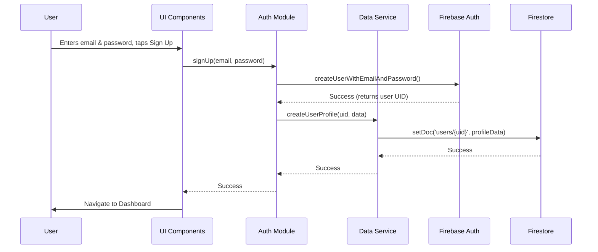
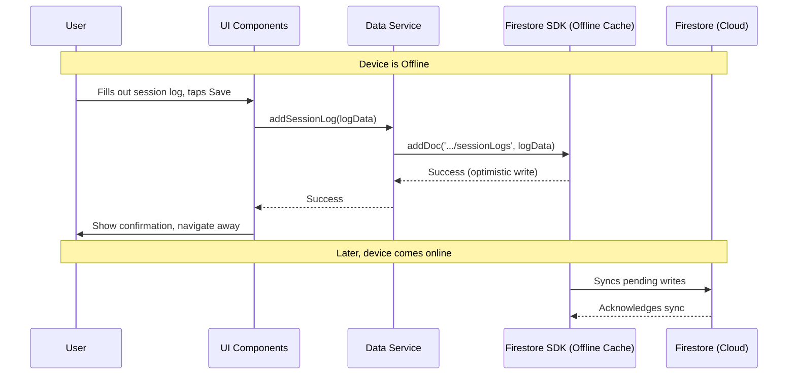

# Track Journal Architecture Document

### 1. High Level Architecture

#### Technical Summary

This document outlines a fullstack architecture for the "Track Journal" mobile application. The system is designed as a mobile-first, offline-capable application built with React Native. It will utilize a Backend-as-a-Service (BaaS) model, leveraging Google Firebase for authentication, database, and future serverless capabilities. The architecture is driver-centric, ensuring all data is owned by the user, while being structured to support future collaborative features. The primary focus is on performance, reliability in offline environments, and creating a scalable foundation for the product's long-term vision, including the AI voice assistant.

#### Platform and Infrastructure Choice

* **Platform:** Google Firebase
* **Key Services:**
    * **Firebase Authentication:** For handling email/password, Google, and Apple sign-in.
    * **Firestore:** A NoSQL, cloud-hosted database for all user data, providing robust offline data persistence.
    * **Firebase Functions (for future use):** A serverless platform to be used for post-MVP features like the AI voice assistant.
* **Deployment Host and Regions:** Cloud infrastructure will be hosted on Google Cloud Platform, primarily in US-based regions, configurable as needed.

#### Repository Structure

* **Structure:** Monorepo.
* **Monorepo Tool:** A single repository managed with standard npm/yarn workspaces.
* **Package Organization:** The initial structure will contain the main React Native application. A `packages/functions` directory can be added later to house serverless logic for post-MVP features, keeping all project code in one place.

#### High Level Architecture Diagram

```mermaid
graph TD
    A[User] --> B{Track Journal App (React Native)};
    subgraph Google Firebase
        C[Firebase Auth];
        D[Firestore Database];
        E((Firebase Functions));
    end
    B --> C;
    B --> D;
    style E fill:#fff,stroke:#f00,stroke-dasharray: 5 5
```

#### Architectural and Design Patterns

  * **Client-BaaS (Backend-as-a-Service):** The mobile app will communicate directly with Firebase services.
      * *Rationale:* This dramatically accelerates MVP development by leveraging managed services for authentication, the database, and offline sync, minimizing the need for custom backend code.
  * **Offline-First:** The application will be architected to be fully functional without an internet connection.
      * *Rationale:* This is a core requirement to ensure the app is reliable at racetracks, which is the primary user environment.
  * **Component-Based UI:** The React Native application will be built using small, reusable components.
      * *Rationale:* This promotes a clean, maintainable, and testable user interface codebase.
  * **Repository Pattern:** All direct communication with Firestore will be abstracted into a dedicated data access layer (the "repository").
      * *Rationale:* This mitigates the risk of vendor lock-in. If we ever need to migrate to a different backend, only this isolated layer of code would need to be rewritten.

-----

### 2\. Tech Stack

| Category | Technology | Version | Purpose | Rationale |
| :--- | :--- | :--- | :--- | :--- |
| **Frontend Language** | TypeScript | **\~5.9** | Primary development language | Provides strong typing to reduce bugs and improve developer experience, especially with AI assistance. |
| **Frontend Framework**| React Native | **\~0.80** | Core framework for building the iOS & Android app | The chosen cross-platform solution with a massive community and support, ideal for AI-driven coding. |
| **UI Component Library**| React Native Paper | **\~6.2** | (Proposed) UI components | A popular, customizable library with a clean, modern aesthetic that aligns with our design goals. Follows Material Design principles. |
| **State Management** | React Context API | N/A | Local & simple global state | Built-in to React. It's the simplest solution for our MVP's needs, avoiding the complexity of a larger library until required. |
| **Backend Runtime** | Node.js | **\~22.x (LTS)** | Runtime for serverless functions | The standard for Firebase Functions, offering excellent performance and TypeScript support. |
| **Backend Platform** | Firebase Functions SDK| **\~5.0** | Serverless function development | The native SDK for building any future backend logic, such as the AI assistant. |
| **API Style** | Firebase SDK | **\~11.2** | Client-to-BaaS communication | Direct, secure, and real-time communication with Firestore and Auth, with built-in offline support. |
| **Database** | Firestore | N/A | Primary database for all app data | The chosen NoSQL database with robust offline and real-time capabilities, central to the app's function. |
| **Authentication** | Firebase Authentication | N/A | User sign-up and log-in services | Handles all authentication flows securely, including email, Google, and Apple providers. |
| **Testing Framework** | Jest | **\~30.1** | Unit and integration testing | The standard testing framework for React Native, providing a comprehensive testing environment. |
| **CI/CD Platform** | GitHub Actions | N/A | Automated builds and deployments | A flexible and powerful tool for automating our testing and release processes to the app stores. |
| **Monitoring & Logging**| Firebase Suite | N/A | App health and usage monitoring | Includes Crashlytics for error reporting and Performance Monitoring to track app speed and reliability. |

-----

### 3\. Data Models

#### User

  * **Purpose:** Represents a registered user of the application.
  * **Firestore Path:** `users/{userId}`
  * **TypeScript Interface:**
    ```typescript
    interface User {
      id: string;
      name: string;
      email: string;
      createdAt: Date;
    }
    ```

#### Vehicle

  * **Purpose:** Represents a single vehicle in a user's "My Garage".
  * **Firestore Path:** `users/{userId}/vehicles/{vehicleId}`
  * **TypeScript Interface:**
    ```typescript
    interface Vehicle {
      id: string;
      userId: string;
      make: string;
      model: string;
      year?: number;
      trim?: string;
    }
    ```

#### SessionLog

  * **Purpose:** Contains all the data for a single track session.
  * **Firestore Path:** `users/{userId}/vehicles/{vehicleId}/sessionLogs/{logId}`
  * **TypeScript Interface:**
    ```typescript
    interface SessionLog {
      id: string;
      vehicleId: string;
      eventName?: string;
      sessionDate: Date;
      trackInfo: {
        trackId: string;
        trackName: string;
      };
      fastestLap?: string;
      averageLap?: string;
      driverRating: number;
      notes?: string;
      tireData: { [corner: string]: { coldPsi: number; hotPsi: number; } };
    }
    ```

#### Track

  * **Purpose:** A global, public collection of racetrack information to be used in searchable drop-downs.
  * **Firestore Path:** `tracks/{trackId}`
  * **TypeScript Interface:**
    ```typescript
    interface Track {
      id: string;
      name: string;
      location?: { latitude: number; longitude: number; };
      country: string;
    }
    ```

-----

### 4\. API Specification

The Track Journal application will not have a traditional server-hosted REST or GraphQL API. Instead, the React Native client will interact directly and securely with Google Firebase services using the official Firebase Client SDK.

The **"API contract"** is defined by the Firebase SDK methods and the Data Models we've outlined.

#### Primary Interaction Patterns

  * **Authentication:** Handled by the Firebase Authentication SDK methods.
  * **Data Reading:** Handled by Firestore SDK methods like `getDoc`, `getDocs`, and real-time listeners like `onSnapshot`.
  * **Data Writing:** Handled by Firestore SDK methods like `addDoc`, `setDoc`, and `updateDoc`.
  * **Security & Authorization:** Enforced by **Firestore Security Rules** deployed on the Firebase backend, ensuring a user can only ever read and write their own data.

-----

### 5\. Components

#### Component List

  * **Authentication Module (Frontend):** Manages all client-side logic for user sign-up, log-in, log-out, and session management.
  * **Data Service / Repository (Frontend):** Manages all data interactions with Firestore, implementing the Repository Pattern.
  * **UI Library (Frontend):** A collection of reusable UI elements (buttons, forms, cards, etc.).
  * **Firebase Authentication (Backend):** A managed service that handles secure user identity.
  * **Firestore Service (Backend):** A managed service that provides the database and enforces Security Rules.

#### Component Interaction Diagram

```mermaid
graph TD
    subgraph Track Journal App (Client)
        A[UI Library] --> B[Authentication Module];
        A --> C[Data Service / Repository];
    end

    subgraph Firebase (Backend)
        D[Firebase Authentication];
        E[Firestore Service];
    end

    B --> D;
    C --> E;
```

-----

### 6\. External APIs

#### MVP Integrations

  * None.

#### Post-MVP Integrations (Future)

  * **AI Service API (e.g., Google Gemini, OpenAI):** To power the AI Voice Assistant.
  * **Telemetry Hardware APIs (e.g., AIM, RaceCapture):** To allow users to import lap times and other vehicle data.

-----

### 7\. Core Workflows

#### Workflow 1: New User Sign-up



#### Workflow 2: Logging a New Session (Offline)



-----

### 8\. Database Schema

This schema translates our data models into a concrete Firestore structure.

#### `users` collection

  * **Path:** `users/{userId}`
  * **Sub-collections:** `vehicles`

#### `vehicles` sub-collection

  * **Path:** `users/{userId}/vehicles/{vehicleId}`
  * **Sub-collections:** `sessionLogs`

#### `sessionLogs` sub-collection

  * **Path:** `users/{userId}/vehicles/{vehicleId}/sessionLogs/{logId}`

#### `tracks` collection

  * **Path:** `tracks/{trackId}`

-----

### 9\. Frontend Architecture

#### Component Architecture

  * **Organization:** Components will be organized in `src/components/` with subdirectories like `ui/`, `forms/`, and `lists/`. Top-level views will be in `src/screens/`.
  * **Template:** Components will be standard React functional components with TypeScript props and use the `StyleSheet` API.

#### State Management Architecture

  * **Approach:** We will use React's built-in **Context API and Hooks** for simple global state (like auth status).

#### Routing Architecture

  * **Library:** We will use **React Navigation**.
  * **Organization:** Logic will be in `src/navigation/`, with separate stacks for authentication and the main app, conditionally rendered based on auth state.

#### Frontend Services Layer (Repository Pattern)

  * **Structure:** All Firebase communication will be in `src/services/`. UI components will call these services, not Firebase directly.

-----

### 10\. Backend Architecture

#### Service Architecture (Serverless)

  * **Organization:** Future Firebase Functions will be organized in `packages/functions/src/` with subdirectories like `http/` and `firestore/`.

#### Database Architecture & Security

  * **Security:** The core of the backend is the set of **Firestore Security Rules** that ensure a user can only access their own data.

#### Authentication and Authorization

  * **Authorization:** Enforced exclusively by the Firestore Security Rules.

-----

### 11\. Unified Project Structure

```
track-journal/
├── android/              # React Native Android project files
├── ios/                  # React Native iOS project files
│
├── src/                  # All application source code
│   ├── assets/
│   ├── components/
│   ├── context/
│   ├── navigation/
│   ├── screens/
│   ├── services/
│   └── types/
│
├── packages/             # Workspace for future packages
│   └── functions/        # Future home for Firebase Functions
│
├── .env.example
├── package.json
└── README.md
```

-----

### 12\. Development Workflow, CI/CD, and Testing

#### Development Workflow

  * **Local Setup:** Standard `npm install` and `.env` file setup.
  * **Commands:** `npm run ios`, `npm run android`, `npm run test`.

#### CI/CD Pipeline

  * **Platform:** **GitHub Actions**.
  * **MVP Pipeline:** Will run linter and tests on every push to `main`. Deployment will be manual for the MVP.

#### Testing Strategy

  * **Unit/Integration Tests:** **Jest** combined with the **Firebase Local Emulator Suite**.
  * **E2E Tests:** Manual testing for the MVP.

<!-- end list -->

```
```