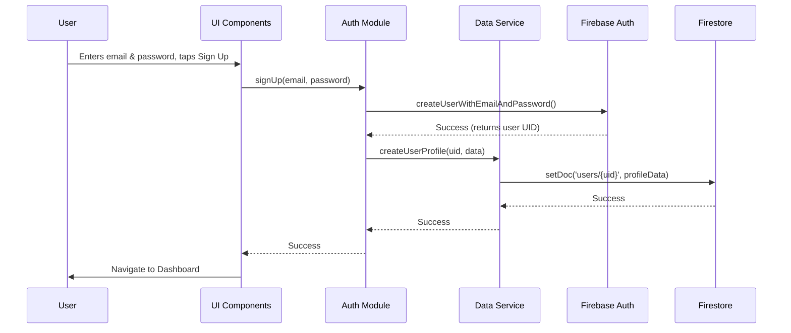
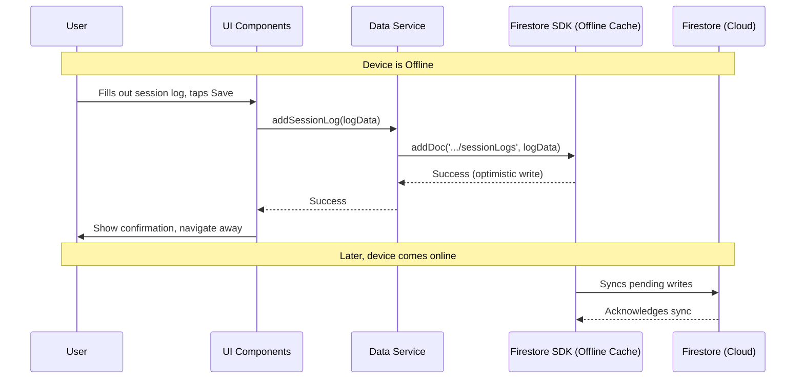

# Core Workflows

## Workflow 1: New User Sign-up

```mermaid
sequenceDiagram
    participant User
    participant UI Components
    participant Auth Module
    participant Data Service
    participant Firebase Auth
    participant Firestore

    User->>UI Components: Enters email & password, taps Sign Up
    UI Components->>Auth Module: signUp(email, password)
    Auth Module->>Firebase Auth: createUserWithEmailAndPassword()
    Firebase Auth-->>Auth Module: Success (returns user UID)
    Auth Module->>Data Service: createUserProfile(uid, data)
    Data Service->>Firestore: setDoc('users/{uid}', profileData)
    Firestore-->>Data Service: Success
    Data Service-->>Auth Module: Success
    Auth Module-->>UI Components: Success
    UI Components->>User: Navigate to Dashboard
```

## Workflow 2: Logging a New Session (Offline)

```mermaid
sequenceDiagram
    participant User
    participant UI Components
    participant Data Service
    participant Firestore SDK (Offline Cache)
    participant Firestore (Cloud)

    Note over User, Firestore (Cloud): Device is Offline
    User->>UI Components: Fills out session log, taps Save
    UI Components->>Data Service: addSessionLog(logData)
    Data Service->>Firestore SDK (Offline Cache): addDoc('.../sessionLogs', logData)
    Firestore SDK (Offline Cache)-->>Data Service: Success (optimistic write)
    Data Service-->>UI Components: Success
    UI Components->>User: Show confirmation, navigate away

    Note over User, Firestore (Cloud): Later, device comes online
    Firestore SDK (Offline Cache)->>Firestore (Cloud): Syncs pending writes
    Firestore (Cloud)-->>Firestore SDK (Offline Cache): Acknowledges sync
```
