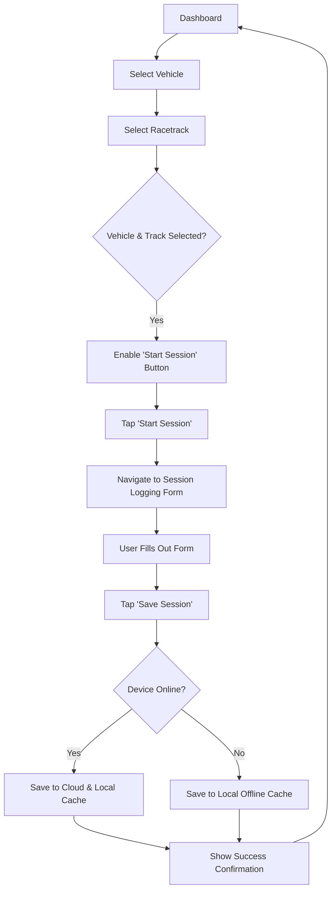

# Track Journal UI/UX Specification

### 1. Overall UX Goals & Principles

#### Target User Personas
* **Primary Persona: "The Amateur Racer / Track Enthusiast"** - A technically minded individual or small team who regularly participates in track days or amateur racing. [cite_start]Their main goal is to maintain a detailed digital history to make informed decisions for future events. [cite: 1494, 1495, 1497]
* **Secondary Persona: The Team (Mechanic/Manager)** - Support staff who need quick, reliable access to the driver's data to perform their roles effectively.

#### Usability Goals
* **Efficiency:** The user must be able to complete the core task of logging a session with maximum speed and minimal taps.
* **Clarity:** The interface should present information in a clean, easily scannable format, especially in a potentially bright and hectic trackside environment.
* **Forgiveness:** The design should prevent data entry errors where possible and make it easy to correct mistakes (e.g., editing a past session).
* **Low Cognitive Load:** The user should not have to think hard about how to use the app; the flow should be natural and predictable.

#### Design Principles
1.  **Speed First:** Every design decision will be optimized for the fastest possible data entry.
2.  [cite_start]**Clarity Over Clutter:** A minimalistic aesthetic will be used to ensure legibility and reduce distraction. [cite: 1560]
3.  [cite_start]**Offline by Default:** The user experience must be seamless and reliable, regardless of internet connectivity. [cite: 1556]
4.  **Progressive Disclosure:** Show only what's needed at each step to avoid overwhelming the user with too many options at once.

---
### 2. Information Architecture (IA)

#### Site Map / Screen Inventory
This diagram shows the relationship between all the core screens identified for the MVP. The flow starts with an authentication stack, which then leads to the main application housed in a tab bar.

```mermaid
graph TD
    subgraph Auth Flow
        A[Sign-in Screen] --> B(Sign-up Screen);
        B --> A;
    end

    subgraph Main App (Tab Bar)
        C[Dashboard / New Session]
        D[My Garage]
        E[Session History]
    end

    A --> C;

    D --> F[Vehicle Detail / Edit];
    C --> G[Session Logging Form];
    E --> H[Session Detail View];
    H --> G;
````

#### Navigation Structure

  * [cite\_start]**Primary Navigation:** The core of the app will use a bottom tab bar with three main destinations, providing persistent access to the most critical sections: [cite: 1561]
    1.  [cite\_start]**Dashboard:** The home screen and starting point for a new session. [cite: 1524]
    2.  [cite\_start]**My Garage:** For managing vehicles. [cite: 1512]
    3.  [cite\_start]**History:** For reviewing past sessions. [cite: 1540]
  * **Secondary Navigation:** Navigation to detail screens (like viewing a specific vehicle or session) will use a "stack" pattern. New screens will slide in from the side and include a clear "back" button in the header, which is a standard and intuitive pattern for mobile apps.
  * **Breadcrumb Strategy:** Breadcrumbs are not a standard mobile navigation pattern. Context will be maintained through clear screen titles and the persistent bottom tab bar.

-----

### 3\. User Flows

#### Flow 1: New User Onboarding

  * **User Goal:** To create a new account and access the main application.
  * **Entry Point:** Opening the app for the first time.
  * **Success Criteria:** The user is successfully logged in and sees the main Dashboard screen.

##### Flow Diagram

```mermaid
graph TD
    A[Open App] --> B{Already Logged In?};
    B -->|No| C[Auth Screen];
    B -->|Yes| D[Dashboard];
    C --> E{Choose Sign-up / Sign-in};
    E -->|Sign-up| F[Enter Credentials];
    F --> G{Credentials Valid?};
    G -->|Yes| D;
    G -->|No| H[Show Error Message];
    H --> F;
```

  * **Edge Cases & Error Handling:** The flow must handle errors such as an email already being in use, weak passwords, or a failed social media authentication. Clear, user-friendly error messages are required.

-----

#### Flow 2: Logging a New Session

  * **User Goal:** To create a complete and accurate log for a track session.
  * [cite\_start]**Entry Point:** The main Dashboard screen. [cite: 1524]
  * **Success Criteria:** The user's session data is securely saved (either locally for offline use or synced to the cloud) and they receive confirmation.

##### Flow Diagram



  * **Edge Cases & Error Handling:** The flow must handle the transition between online and offline states gracefully. If a save fails for any reason, the user's entered data should be preserved so they don't lose it.

-----

### 4\. Wireframes & Mockups

  * **Primary Design Files:** All high-fidelity mockups and prototypes will be created and maintained in an external design tool like Figma. This will be the single source of truth for the application's visual design.
  * **Key Screen Layouts:** The layouts will be developed for the "Core Screens" identified in the Information Architecture, ensuring a consistent and intuitive user experience across the app.

-----

### 5\. Component Library / Design System

  * **Design System Approach:** For the MVP, we will leverage our chosen UI library, **React Native Paper**, as a base. We will build a small set of custom, reusable components on top of it for application-specific needs.
  * **Core Custom Components:**
      * `VehicleCard`: A component to display summary information for a car in the "My Garage" list.
      * `SessionListItem`: A component to display summary information for a log in the "Session History".
      * [cite\_start]`TireDataInput`: The visual graphic component for entering tire pressures and temperatures. [cite: 1535]

-----

### 6\. Branding & Style Guide

  * [cite\_start]**Visual Identity:** The design will adhere to the PRD requirement for a "dark color scheme with silver/white accents", creating a modern, clean, and minimalistic aesthetic. [cite: 1559, 1560]
  * **Color Palette:**
      * **Primary:** Dark Gray/Charcoal (for backgrounds)
      * **Secondary:** Mid Gray (for cards and surfaces)
      * **Accent:** A vibrant color (e.g., Electric Blue or Racing Yellow) for buttons and interactive elements.
      * **Text/Icons:** White and Light Gray.
  * **Typography:** We will use a standard, highly legible sans-serif font family like **Inter** or **Roboto** to ensure clarity on mobile screens.

-----

### 7\. Accessibility Requirements

  * **Compliance Target:** The application will target **WCAG AA** compliance.
  * **Key Requirements:**
      * **Visual:** All text will meet minimum color contrast ratios. Focus indicators will be clear for all interactive elements.
      * **Interaction:** The app will be fully navigable using screen reader technology (e.g., VoiceOver, TalkBack). Touch targets will meet minimum size requirements.

-----

### 8\. Responsiveness Strategy

  * **Breakpoints:** The design will be responsive to standard mobile device screen sizes, from smaller phones to larger "phabets".
  * **Adaptation Patterns:** The primary focus will be on ensuring layouts adapt gracefully to different screen widths and support both portrait and landscape orientations where practical.

-----

### 9\. Animation & Micro-interactions

  * **Motion Principles:** Animations will be subtle, purposeful, and performance-focused. They will be used to provide feedback on user actions and guide the user's attention without being distracting.

-----

### 10\. Performance Considerations

  * **Performance Goals:** The app must feel fast and responsive. This includes a quick startup time and smooth scrolling, especially in the Session History list.

-----

### 11\. Next Steps

  * **Immediate Actions:** With the completion of this specification, the next step is a handoff to the Architect.
  * **Design Handoff Checklist:**
      * [x] All user flows documented.
      * [x] Component inventory identified.
      * [x] Accessibility requirements defined.
      * [x] Brand guidelines established.

<!-- end list -->
